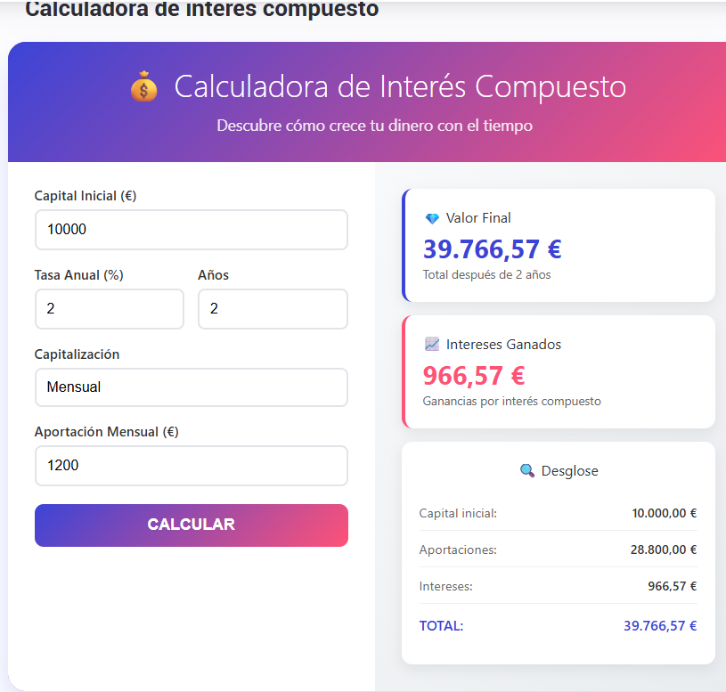

<div align="center">

  

  # Compound Interest Master

  **Calculadora financiera moderna y herramienta de proyección del interés compuesto para Android**

  [](https://kotlinlang.org)
  [-3DDC84.svg?logo=android)](https://developer.android.com)
  [](https://developer.android.com/jetpack/compose)
  [](https://m3.material.io)
  [](#)

  <p align="center">
    <i>Diseñada para planificar, simular y visualizar el crecimiento exponencial de tus inversiones y ahorros con una experiencia nativa y fluida.</i>
  </p>

</div>

---

## 📱 Vista Previa

<div align="center">
  
</div>

---

## 💡 ¿Qué es Compound Interest Master?

**Compound Interest Master** es una aplicación financiera de alto rendimiento desarrollada de forma nativa para Android. Integra un motor financiero de precisión con una interfaz moderna y reactiva bajo las directrices de **Material 3 Expressive** y soporte visual completo **Edge-to-Edge**.

La aplicación permite a los usuarios proyectar metas financieras en tiempo real, desglosar capital acumulado versus aportaciones e intereses, alternar entre múltiples divisas internacionales y visualizar el crecimiento patrimonial mediante gráficos interactivos.

---

## ✨ Características Principales

### 🧮 Modos de Cálculo Financiero
- **¿Cuánto puedo ahorrar? (Future Value)**: Proyección del capital final a partir de un importe inicial, aportaciones periódicas, rentabilidad anual y plazo.
- **¿Cuánto tardaré en alcanzar mi objetivo? (Time to Goal)**: Cálculo del tiempo exacto requerido para alcanzar un objetivo patrimonial.
- **¿Cuánto necesito ahorrar cada periodo? (Required Contribution)**: Determinación de la cuota periódica para cumplir una meta de ahorro.
- **¿Qué porcentaje de interés necesito? (Required Rate)**: Identificación de la tasa anual requerida para lograr el objetivo en un plazo fijado.

### ⚙️ Personalización Financiera Avanzada
- **Frecuencia de capitalización**: admite periodos semanales (52x), bisemanales (26x), mensuales (12x) y anuales (1x).
- **Momento de la aportación**: configuración al inicio (*Beginning*) o al final (*End*) de cada periodo.
- **Soporte multidivisa**: formato localizado automático para distintas monedas (EUR €, USD $, GBP £, etc.).

### 📊 Análisis Visual & Reportes
- **Gráficos Interactivos con Vico**: Curvas dinámicas de crecimiento proyectado año a año.
- **Tarjetas de Resultados Expressive**: Desglose visual entre saldo final, aportaciones totales e intereses netos generados.
- **Tabla Desglosada por Año**: Historial estructurado para inspección detallada del progreso financiero.

---

## 🏛️ Arquitectura del Sistema

El proyecto sigue una arquitectura **Clean Architecture + MVVM (Model-View-ViewModel)** orientada a la reactividad y testeabilidad:

```text
┌─────────────────────────────────────────────────────────────┐
│                       Presentation                          │
│   Jetpack Compose UI  ◄───►  MainViewModel (StateFlow)      │
└──────────────────────────────┬──────────────────────────────┘
                               │
                               ▼
┌─────────────────────────────────────────────────────────────┐
│                          Domain                             │
│   CalculateCompoundInterestUseCase   ◄───►   Domain Models  │
└──────────────────────────────▲──────────────────────────────┘
                               │
                               ▼
┌─────────────────────────────────────────────────────────────┐
│                           Data                              │
│   LocaleMapper  ◄───►  Currency & Format Providers          │
└──────────────────────────────▲──────────────────────────────┘
```

- **Unidirectional Data Flow (UDF)**: La vista emite eventos de usuario y se recompone ante cambios inmutables de `MainUiState`.
- **Casos de Uso Aislados**: Lógica matemática pura independiente del framework de Android para mayor velocidad de ejecución y cobertura de pruebas.
- **Inyección de dependencias**: gestión con **Hilt** y procesamiento mediante **KSP (Kotlin Symbol Processing)**.

---

## 🛠️ Stack Tecnológico

| Componente | Tecnología | Versión / Detalle |
| :--- | :--- | :--- |
| **Lenguaje** | [Kotlin](https://kotlinlang.org/) | `2.4.10` |
| **UI Toolkit** | [Jetpack Compose](https://developer.android.com/jetpack/compose) | BoM `2026.08.00` |
| **Diseño** | [Material 3 Expressive](https://m3.material.io/) | Tokens dinámicos, gradientes y animaciones Spring |
| **Arquitectura** | Android Jetpack Architecture | MVVM + StateFlow + Clean Usecases |
| **Inyección de Dependencias** | [Dagger Hilt](https://dagger.dev/hilt/) | `2.60.1` con KSP |
| **Gráficos** | [Vico Charts](https://patrykandpatrick.com/vico/) | `3.3.1` (Compose M3) |
| **Compilación & Build** | Android Gradle Plugin (AGP) | `9.4.0` con Version Catalog (`libs.versions.toml`) |
| **Java Compatibility** | Java JDK | `21` |
| **Target SDK** | Android API | Min SDK `24` / Target & Compile SDK `37` |

---

## 🧪 Estrategia de Testing

La calidad del software se valida mediante una pirámide de pruebas completa:

1. **Pruebas Unitarias (`app/src/test`)**:
   - `CalculateCompoundInterestUseCaseTest`: Valida la precisión de las fórmulas de capitalización, tasas periódicas y flujos de aportación.
   - `MainViewModelTest`: Valida las emisiones de estado, manejo de inputs y sincronización de divisas.
2. **Pruebas de Instrumentación & UI (`app/src/androidTest`)**:
   - Validación de componentes de Jetpack Compose bajo `HiltTestRunner`.
   - Pruebas End-to-End con el patrón **Robot** para simular la interacción del usuario.

### Ejecución de Pruebas

```bash
# Ejecutar todas las pruebas unitarias locales
./gradlew test

# Ejecutar pruebas de instrumentación en dispositivo o emulador conectado
./gradlew connectedAndroidTest
```

---

## 🚀 Instalación y Configuración

### Requisitos Previos
- **Android Studio**: Android Studio Ladybug (o versión más reciente).
- **JDK**: Java Development Kit 21 instalado y configurado en el entorno de desarrollo.
- **Android SDK**: Plataforma SDK 37 y herramientas de compilación compatibles.

### Pasos de Configuración

1. **Clonar el repositorio:**
   ```bash
   git clone https://github.com/FeryaelJustice/CompoundInterestMaster.git
   cd CompoundInterestMaster
   ```

2. **Abrir en Android Studio:**
   - Selecciona `File > Open...` y navega hasta la carpeta del proyecto.
   - Permite que Gradle sincronice las dependencias del Version Catalog.

3. **Compilar el proyecto:**
   ```bash
   # Compilar versión Debug
   ./gradlew assembleDebug

   # O generar el Bundle / APK de Release
   ./gradlew assembleRelease
   ```

4. **Instalar en un dispositivo o emulador:**
   ```bash
   ./gradlew installDebug
   ```

---

## 📄 Licencia

Copyright (c) 2026 Feryael Justice. Todos los derechos reservados.
